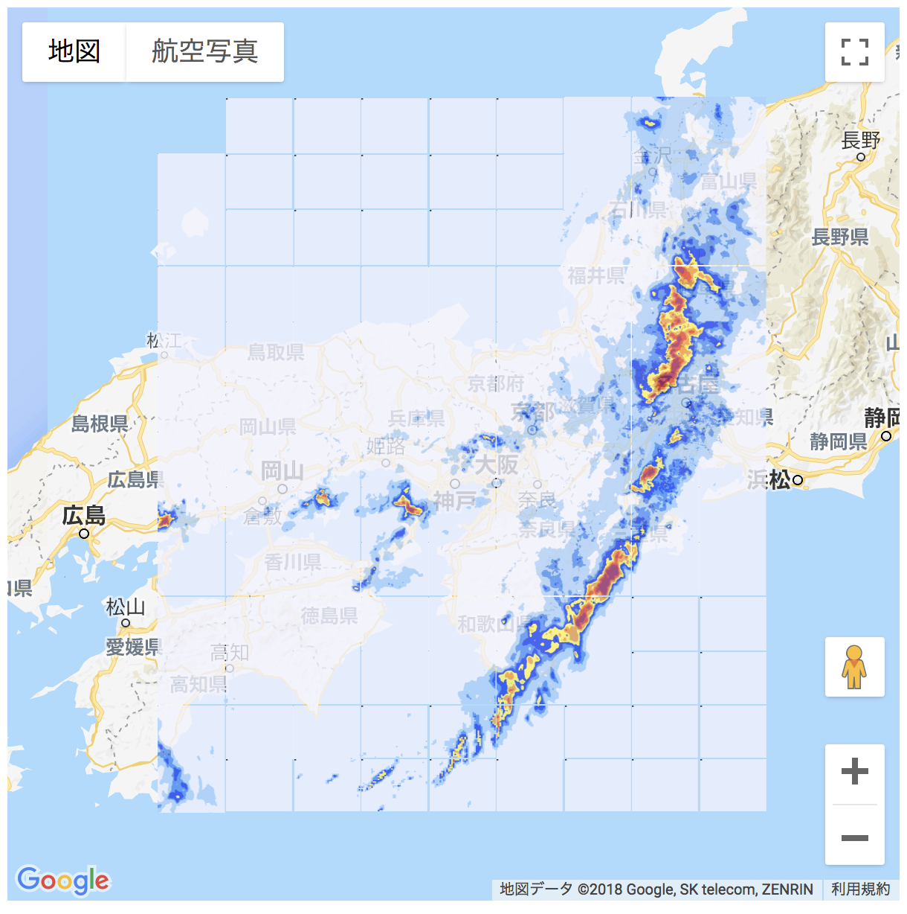

# 概要

wgrib2を用いて高解像度降水ナウキャストのgrib2をパースする

# 動作サンプル

[example.ipynb](example.ipynb)

# GoogleMapsJSでの描画

https://tenki.jp/past/2018/07/07/radar/6/ の21時00分との一致を確認

## APIキー

[map/index.html](map/index.html)の `YOUR_KEY` を自身のAPIキーに置換する

## run

ブラウザからはセキュリティの関係でローカルファイルを直接読めないため、[./map/run](./map/run) を実行して、ビルドインサーバを起動してからファイルを読む

# サンプルデータ

気象業務支援センター より公開されているサンプルデータ(Pri60lv_Aper5min_20180707-1.zip, Pri60lv_Aper5min_20180707-2.zip) での動作確認済み

http://www.jmbsc.or.jp/jp/online/c-onlineGsample.html#sample413

# references

- http://www.hysk.sakura.ne.jp/Linux_tips/how2use_wgrib2
- https://qiita.com/ysomei/items/12d6622bed030f6ac793